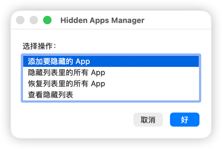

# macOS 26 (Tahoe) Hidden Apps Guide

## 核心
1.使用 LaunchServices 取消注册:
```
lsregister -u <app_path>
```
2. 脚本编辑器.app(Script Editor.app)编辑转换为app
---

## AppleScript 内容（GUI）

此脚本提供图形用户界面（GUI），用于：
- 将应用添加到隐藏列表
- 隐藏列表中的所有应用
- 恢复应用
- 查看列表



### 从源码重新生成 ‘.app’
可以用脚本编辑器.app打开，然后导出为app，也可以用脚本（脚本不一定对，没有测试过）
```
osacompile -o "Hidden Apps Manager.app" "/<path>/Hidden Apps Manager.applescript"
```
---

## License
MIT
